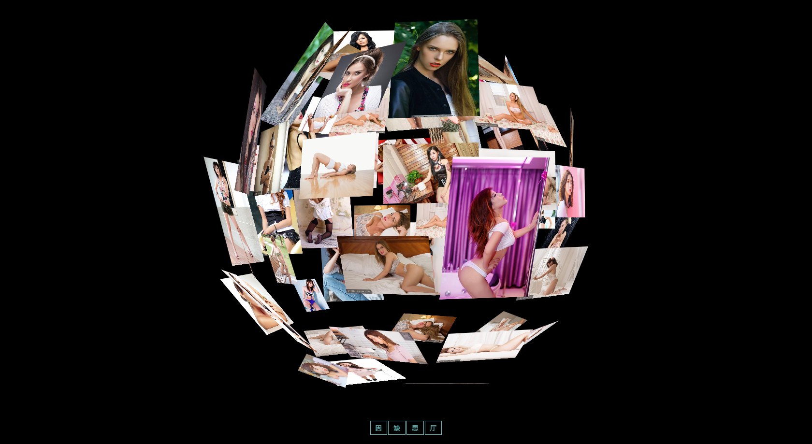
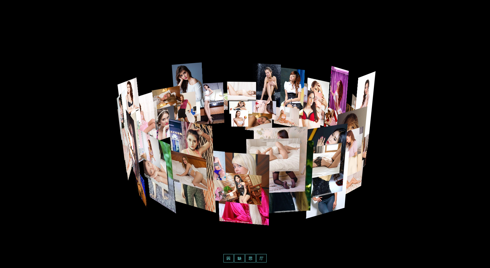
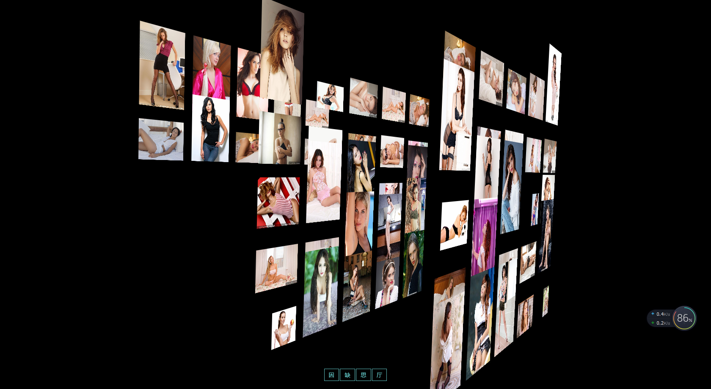

# three.js-css3D
A small example shows the effect of three.js css3D while using tween.js to make graphic changes

## 效果展示（截图）Show results

**友情提示：可以配合鼠标滚轮 按键进行调整 左键方向 右键平移**
 
**Can be adjusted with the mouse wheel button Left arrow direction Right click**

**自行可调整html中的参数来达到所需的要求 还增加了单个element点击事件 可自行修改**
